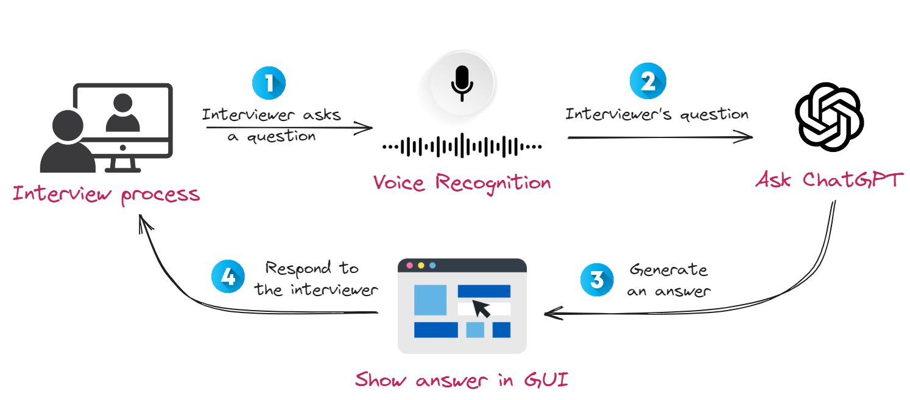

# **[Идея и реализация взята здесь](https://slgero.medium.com/hack-your-next-interview-with-generative-ai-fb8c8bc3cbce)**

Проект был взят с зарубежного github'a и адаптирован под  
СНГ.
Поможет, в прохождении интервью или защите проектов онлайн.
Суть доработок, что используется сервис проксированного доступа  
к API OpenAI, поскольку, сами знаете, какие проблемы,  
и русифицирован интерфейс и добавлено распознавание русской речи.
Пользуйтесь на здоровье, и ключик к API можете взять у ProxyAPI,
если что не реклама, сам просто у них брал, чтобы не париться с оплатой
напрямую и не сидеть с VPN'ом.

### Архитектура проекта:


### Как запустить:
```sh
pip install -r requirements.txt
python ./src/simple_ui.py
```
